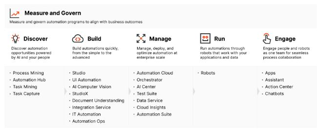

# Introduction to RPA and automation

Autor: Daniel Arbeláez

Fecha: 23-06-2022

Link al curso: [RPA Starter](https://academy.uipath.com/learning-plans/rpa-starter)

## Tabla de contenido

- [Introduction to RPA and automation](#introduction-to-rpa-and-automation)
  - [Tabla de contenido](#tabla-de-contenido)
  - [What you'll learn in this course](#what-youll-learn-in-this-course)
  - [What Is RPA? What Is Automation?](#what-is-rpa-what-is-automation)
  - [Automation Is Driving the Digital Transformation](#automation-is-driving-the-digital-transformation)
  - [Automation in Business](#automation-in-business)
  - [The Automation Journey](#the-automation-journey)

## What you'll learn in this course

At the end of this course, you should be able to:

1. Define RPA and automation and explain their impact on digital transformation.
2. Map and assess some of the business processes that are fit for automation.
3. Describe the main stages of the typical enterprise automation journey and the role played by the Center of Excellence.
4. Explain the components of the UiPath Platform and the benefits it brings to the fully automated enterprise

## What Is RPA? What Is Automation?

RPA: Permite que robots de software realicen tareas repetitivas basadas en reglas. Pueden imitar las acciones humanas haciendo que los procesos funcionen.

Aspectos a tener en cuenta:

- RPA Software puede cometer errores tanto como haya configurado la buena ejecución del proceso automatizado
- Con lenguajes de programación y API's se puede automatizar pero implica tener problemas de escalabilidad
- El RPA puede existir en cualquier industria que contenga actividades repetitivas
- El RPA puede disminuir los costos operacionales y un aumento en la eficiencia
- RPA se centra en tareas rutinarias, repetitivas y tediosas

Habilidades de un robot de RPA:

- Extraer datos estructurados de documentos
- Iniciar sesión y ejecutar aplicaciones
- Abrir correos electrónicos y archivos adjuntos
- Completar formularios
- Escrubir en bases de datos
- Hacer calculos
- Conectarse a otros sistemas
- Mucho más

## Automation Is Driving the Digital Transformation

La automatización no pretende reemplazar a las personas, en cambio busca liberarlas. Algunas de las razones por las que la RPA puede convertirse en una herramienta muy versatil sería:

- Habilidades IA: Para el reconocimiento de texto en documentos (reconocmiento óptico inteligente). Analizar y procesar texto
- Machine Learning: Aprender del trabajo automatizado
- Integración nativa: Facilita el uso de aplicaciones existentes en la empresa
- Flujos de trabajo de ejecución prolongada (Long-running Workflows): Poder realizar procedimientos en paralelo (para este proceso es necesario orquestar de acuerdo a la disponibilidad de los robots para que los mismos puedan utilizar su máximo potencial)
- Mineria de procesos y de tareas: los datos sin procesar los convierte en graficos e información de valor para poder realizar futuras automatizaciones
- Analiticas avanzadas: Ayuda a procesar datos y generar información de valor con la tecnología RPA

## Automation in Business

Algunos de las actividades en las que se puede aplicar la RPA son:

- Procesamiento de nóminas
- Actualización de información de cliente
- Conciliuación de estados financieros
- Informes de cumplimiento (auditorias)
- Categorizar quejas de los clientes

> La automatización no sólo repercute en los ingresos y el tiempo: la automatización de las tareas repetitivas también conduce a una mejora de la experiencia de los clientes y los empleados, facilita las operaciones de IA, garantiza el cumplimiento de la normativa y agiliza el proceso de toma de decisiones.

## The Automation Journey

- **Discover**: Esta fase se centra en la definición de la gobernanza de los procesos y en el uso de los datos para para elegir los procesos adecuados para la automatización; las oportunidades de automatización las identifica el empleado o las tecnologías impulsadas por la IA.
- **Build**: En la fase de construcción hay soluciones que se dirigen a:
  - **Professional automation developers**: Que ofrecen potentes herramientas de desarrollo y depuración, integraciones avanzadas, así como funciones.
  - **Business Users**: Que automatizan rápidamente sus aplicaciones empresariales sin necesidad de recursos de desarrollo o conocimientos de codificación.
- **Management**: Las capacidades de gestión ayudan a probar, desplegar, gestionar y optimizar el rendimiento de la flota de robots y de las capacidades de IA.
- **Running**: El funcionamiento de los robots tiene que ofrecer flexibilidad, ajustándose a los tipos de procesos automatizados, al tipo de colaboración entre humanos y robots y a la configuración existente.
- **Engagement**: El compromiso entre los usuarios humanos y los robots se produce de forma sencilla, siempre que sea necesario.

Meet StudioX: Es una herramienta que se utiliza para crea el flujo de trabajo de una automatización de una forma no-code

Para mayor detalle de cada uno de las herramientas de UIPath, ingresar al documento [The UiPath Platform](assets/The_UiPath_Platform.pdf)

[Diploma de finalización de estudios](assets/LearningPath_Certificate_06302022122608768.pdf)
