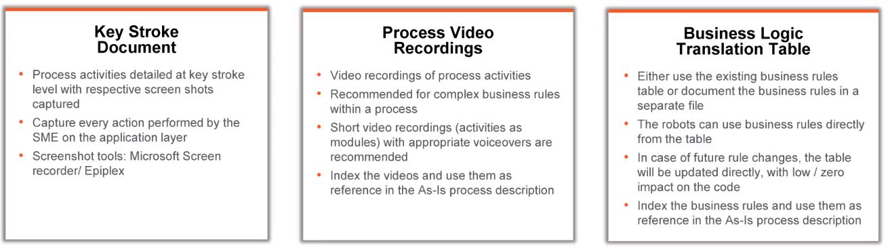

# RPA Business Analysis Fundamentals

Autor: Daniel Arbeláez

Fecha: 30-06-2022

Link al plan de aprendizaje: [RPA Business Analyst Foundation](https://academy.uipath.com/learning-plans/rpa-business-analyst-foundation)

## Tabla de contenido

- [RPA Business Analysis Fundamentals](#rpa-business-analysis-fundamentals)
  - [Tabla de contenido](#tabla-de-contenido)
  - [INTRODUCTION TO THE RPA BUSINESS ANALYST ROLE](#introduction-to-the-rpa-business-analyst-role)
    - [What you'll learn in this course](#what-youll-learn-in-this-course)
    - [What is a Process? The RPA Perspective](#what-is-a-process-the-rpa-perspective)
    - [The RPA Business Analyst: Role, Skills, and Challenges](#the-rpa-business-analyst-role-skills-and-challenges)
  - [THE RPA JOURNEY AND THE BA’S ROLE](#the-rpa-journey-and-the-bas-role)
    - [Overview](#overview)
    - [Prepare RPA](#prepare-rpa)
    - [Solution Design](#solution-design)
      - [Objetivos que se buscan alcanzar en esta fase](#objetivos-que-se-buscan-alcanzar-en-esta-fase)
      - [Técnicas para lograr el descubrimiento de procesos](#técnicas-para-lograr-el-descubrimiento-de-procesos)
      - [Planificación para recopilar y estructurar la documentación de los procesos (enfoque iterativo)](#planificación-para-recopilar-y-estructurar-la-documentación-de-los-procesos-enfoque-iterativo)
      - [Recopilación de requisitos del proceso](#recopilación-de-requisitos-del-proceso)
      - [Mapa de procesos High Level](#mapa-de-procesos-high-level)
      - [Información relacionada con la entrada y salida de datos](#información-relacionada-con-la-entrada-y-salida-de-datos)
      - [Métodos y herramientas para documentar procesos](#métodos-y-herramientas-para-documentar-procesos)
      - [Actividades o procesos que no se pueden automatizar](#actividades-o-procesos-que-no-se-pueden-automatizar)
      - [Manejo de excepciones](#manejo-de-excepciones)
      - [Historial de documento y flujo de aprobación](#historial-de-documento-y-flujo-de-aprobación)
      - [Recursos adicionales](#recursos-adicionales)
    - [Build RPA](#build-rpa)
    - [Test RPA](#test-rpa)
    - [Stabilize RPA](#stabilize-rpa)
    - [Constant Improvement (Mejora continua)](#constant-improvement-mejora-continua)
      - [Recursos Adicionales](#recursos-adicionales-1)

## INTRODUCTION TO THE RPA BUSINESS ANALYST ROLE

### What you'll learn in this course

At the end of this course you should be able to:

1. Describe the role of a Business Analyst throughout each of the stages of an RPA implementation;
1. Understand the challenges a BA can face and define the ways to overcome them;
1. Conduct an Opportunity Assessment in order to identify the best processes to automate with RPA;
1. Apply best practices in documenting processes proposed for automation;
1. Outline a Process Design Document and other relevant documentation;
1. Prepare and coordinate a UAT plan;
1. Support in managing changes throughout the entire automation life-cycle.

### What is a Process? The RPA Perspective

**Conceptos:**

Proceso: Un conjunto de actividades interrelacionadas o que interactuan que transforman entradas en salidas

Componentes: Los principales componentes que conforman un proceso son las entrada (son eventos que desencadenan el proceso), flujos de procesos (secuencias de subprocesos o actividades realizadas durante el proceso), recursos de aplicaciones (representan las aplicaciones que son utilizadas para realizar los subprocesos o actividades del proceso) y salidas (representan el resultado generado por el proceso)

Salidas: Las salidas de un proceso pueden servir como entradas para otros procesos

Adicional a lo anterior, existen más elementos en la definición de un proceso estándar como limitaciones de tiempo, la dependencia de otros procesos, las variaciones y la forma en se asignan los recursos

> Fundamentalmente un procedimiento complementa un proceso, es decir, describe la forma en que se lleva a cabo

> Un proceso se representa en un flujo, ya sea en un diagrama de flujo o un flujo de trabajo donde se describe la secuencia lógica de los pasos del proceso. De otro lado, un procedimiento es un documento escrito complejo que se centra en proporcionar directrices

### The RPA Business Analyst: Role, Skills, and Challenges

- Role

    

- Skills required

    

- Challenges ahead

    

## THE RPA JOURNEY AND THE BA’S ROLE

### Overview

### Prepare RPA

En esta estapa el BA evalúa las oportunidades de RPA, determina la capacidad de automatización de cada proceso individual, da prioridad a los procesos según su complejidad y se calculan los beneficios potenciales de la automatización sean tangibles o intangibles.

### Solution Design

#### Objetivos que se buscan alcanzar en esta fase

- Conocer a fondo el proceso completo.
- Documentar y validar con el dueño del proceso el "As-Is" (tal cual -  es la definición de la situación actual del proceso) de la descripción del proceso y toda la data relevante para el RPA (para este caso se debe recolpilar toda la información necesaria como procedimientos operativos estándar, mapas de procesos, organigramas, manuales de usuario y demás documentación recopilada en la fase de **preparación**; puede suceder que la información no exista de forma tal que el analista deberá investigar y recopilar datos y crearlos).
- Diseñar el "To-Be" (para ser -  está definiendo el futuro de la situación del proceso) del flujo de proceso empresarial después de la automatización (se refina el proceso hasta su forma más eficiente y efectiva teniendo en cuenta el potencial de la RPA)
- Llevar la documentación final a los desarrolladores de la solución.

#### Técnicas para lograr el descubrimiento de procesos

- Entrevistas individuales o grupos pequeños, talleres de descubrimiento, análisis de documentación existente, todo lo anterior con los propietarios del proceso y los expertos en la materia.
- Con estas técnicas se pueden determinar complejidad, alcance, determinar si es suceptible de RPA, clasificación continua del proceso, determinar motivos para automatización mientras se crea el documento de diseño del proceso.

#### Planificación para recopilar y estructurar la documentación de los procesos (enfoque iterativo)

1. Levantamiento de requisitos
2. Crear mapas de proceso
3. Validación por el responsable del proceso
4. Creación de escenarios y reglas empresariales
5. Validación por el responsable del proceso
6. Si se aprueba lo anterior será posible crear mapa de procesos detallado con una descripción global
7. Luego se describe el flujo del proceso "To-Be" y la solución (se describen los pasos que están al alcance de la automatización y los que no)
8. Se completa y se firma el documento de diseño del proceso

> Para los cambios es importante validar que si se trata de un componente nuevo lo ideal es terminar el proceso actual y validar para una proxima revisión la incorporación de ese nuevo proceso. Así evitamos que se extienda el tiempo de entrega

#### Recopilación de requisitos del proceso

- Métricas del proceso: se pueden obtener las métricas con ayuda de herramientas existentes de flujo de trabajo o de BPM y se busca medir el volúmen de transacción, tiempo medio operativo y el esfuerzo total de FTE (Full Time Equivalent)
- Información del proceso: horas de apertura y cierre, aumento previsto del volumen de transacciones para anticipar si se debe escalar los robots, información sobre todas las partes interesadas implicadas y sus roles, al mismo tiempo que la entrada, el resultado y su tipo.
- Requerimientos de infraestructura: Disponibilidad del ambiente de pruebas, software y hardware necesario para UIPath.
- Aplicaciones usadas: Se deben entender todas las aplicaciones que hacen parte del proceso teniendo en cuenta la documentación que detalla la misma, como funcionan y si usan diferentes instancias
- Utilizar entornos virtuales: Para detemrinar si el cliente es ligero o pesado. Ligeros: requieren la automatización de un escritorio virtual o remoto. Pesado: solo usan aplicaciones de escritorio

#### Mapa de procesos High Level

#### Información relacionada con la entrada y salida de datos

#### Métodos y herramientas para documentar procesos

#### Actividades o procesos que no se pueden automatizar

Estas actividades independiente si no se pueden automatizar deberán documentarse.

#### Manejo de excepciones

Solo el "Happy path" (ruta feliz, ruta en el mejor de los casos) no es suficiente para determinar el registro completo de un proceso, por lo tanto se debe evaluar todos los escenarios posibles.

Se deben evaluar y documentar las excepciones que se pueden manejar con el robot, es decir, las que son relativas a la lógica del negocio.

También debe documentarse si la aplicación del sistema que usa el robot puede presentar excepciones que impidan la buena ejecución del proceso. Para este caso el robot debe manejar la excepción enviando un correo a un manejador humano o los medios que concuerden con las reglas del negocio.

Adicionalmente, existen excepciones conocidas y desconocidas que deben documentarse e igualmente son las que en primer lugar se conocen y tienen una posible solución para su buena ejecución y en segundo lugar son las que pueden llegar a suceder pero que se desconocen.

#### Historial de documento y flujo de aprobación

- Historial de documento: Contiene la fecha de creación del documento o de las versiones, el nombre, el rol, función y comentarios que resumen los cambios en esa versión concreta.

#### Recursos adicionales

[Documento del Diseño del Proceso - Plantilla](assets/PDD_Template.docx)

[Escenario de prueba - Plantilla](assets/Test_Scenario_Template.xlsx)

[Caso de prueba - Plantilla](assets/Test_Case_Template.xlsx)

> Nota: un escenario de prueba puede tener uno o más casos de prueba. El caso de prueba es más específico que el escenario de prueba

### Build RPA

Las responsabilidades del analista de RPA en esta fase comprende la gestión de cambios que puedan ser necesarios durante este punto del proceso. Por lo anterior, el BA deberá:

- Analizar los cambios propuestos
- Identificar el impacto
- Usar matriz de trazabilidad para registrar los cambios aprobados
- Actualizar el PDD

### Test RPA

En esta etapa se prepara la salida a producción y en general debe de crearse un registro de errores que facilitará la corrección rápida para futuros casos

### Stabilize RPA

Las principal responsabilidad del BA en esta etapa es la de entrenarse para comprender toda la información relacionada con la implementación para así permitir que las personas involucradas en el proyecto estén familiarizadas con los proyectos de automatización, entre otros, el equipo de implementación, los equipos de operaciones y soporte técnico. En esta parte se incluye el manual de usuario y se asegura el BS de que los documentos creados hayan llegado a todas las partes involucradas

### Constant Improvement (Mejora continua)

En esta etapa se centra en dos actividades principales:

- Evaluación del rendimiento: Esta actividad se realiza entre el BA y el gestor del proyecto y se hacen mediciones del rendimiento de la RPA
- Gestión de cambios: En esta actividad se deben de administrar correctamente los cambios ya que se dividen en 3 tipos, los cambios de las entradas, cambios en el proceso donde se deben eliminar pasos y cambios en el orden de ejecución de los pasos existentes.

> Se da la administración de los cambios, puede ser en tecnología

Existen 3 tipos en la evaluación de cambios:

#### Recursos Adicionales

[Matriz de trazabilidad - Plantilla](assets/Traceability_Matrix_Template.xlsx)

[Formulario de solicitud de cambios - Plantilla](assets/Change_Request_Form_Template.docx)

[Registro de errores - Plantilla](assets/Issue_Log_Template.xlsx)

[Herramienta de evaluación de procesos - Plantilla](assets/Process_Assessment_Tool.xlsx)

> Un proceso mal estudiado es normalmente una situación que crea un mantenimiento crónico. Otro factor que provoca un mantenimiento crónico del robot si se hacen las cosas bien puede fallar cuando los dueños del proceso cambian los mismos, ya que no tienen un estándar para dicho proceso. *Anderson Henao Pimienta*

[Diploma de finalización de estudios](assets/LearningPath_Certificate_07142022161608777.pdf)
